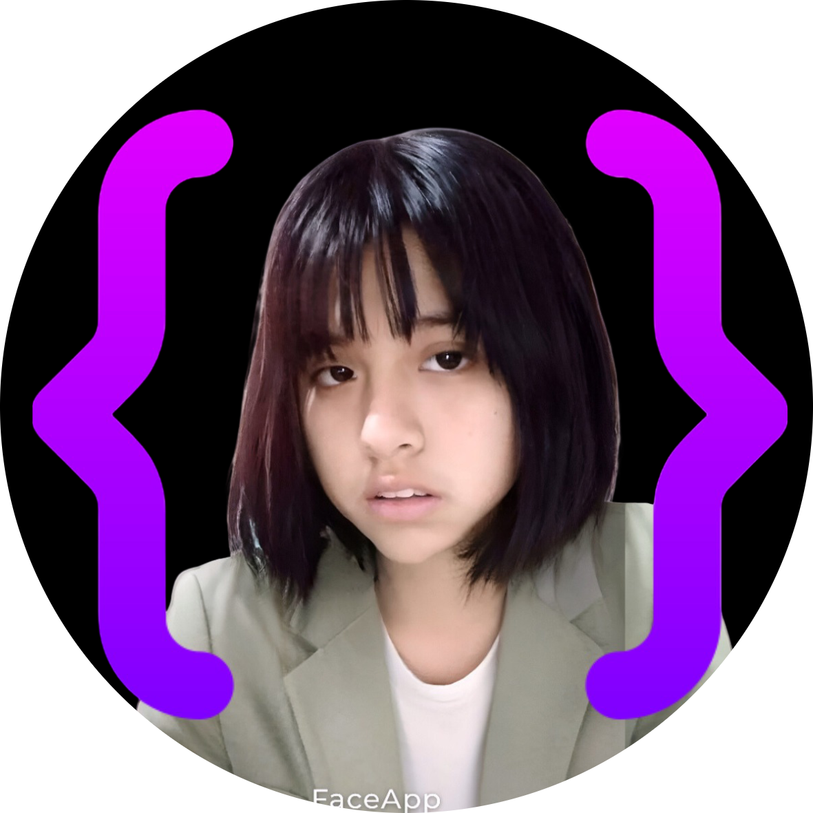
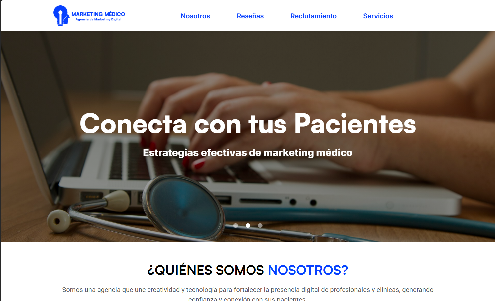
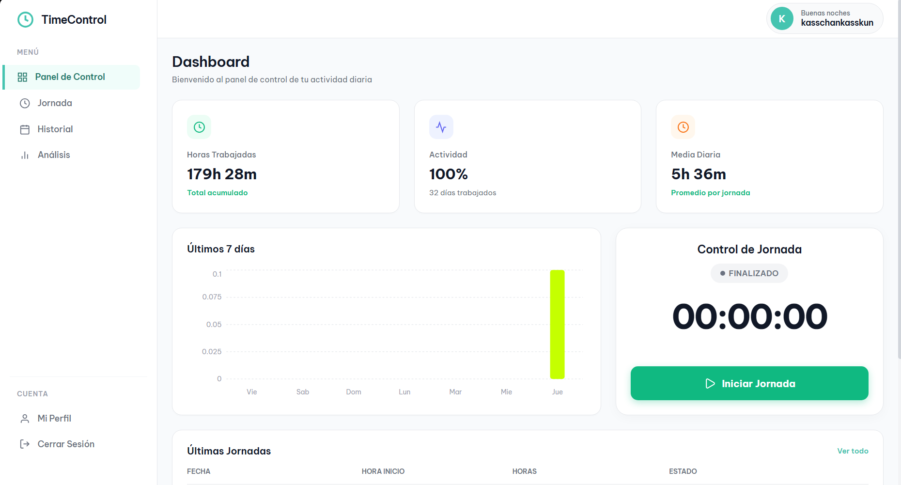
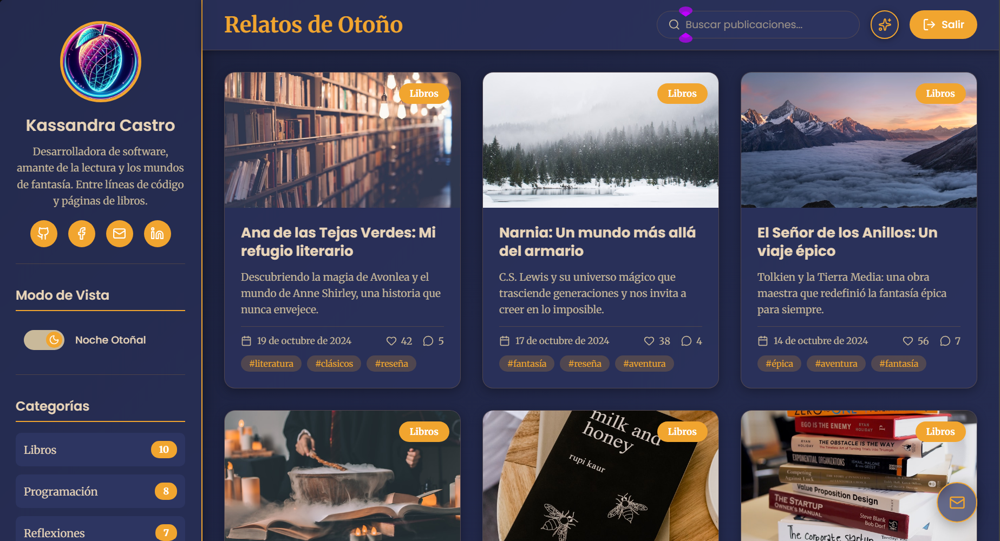
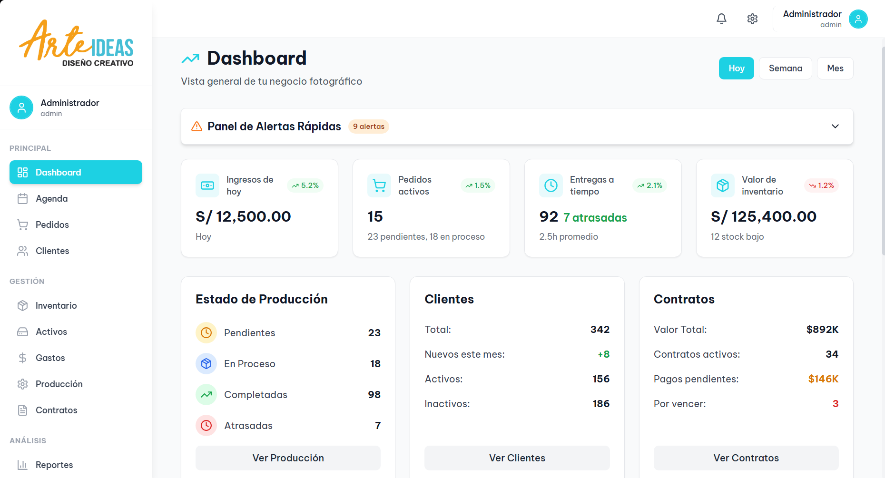

# ¡Hola! Soy Kassandra Castro 👋

  

  

---

### 🚀 Sobre Mí
¡Bienvenido a mi espacio digital! Soy una **Desarrolladora Frontend Junior** con una mentalidad orientada a la resolución de problemas y una gran pasión por el diseño de interfaces de usuario excepcionales. Mi enfoque combina la **precisión técnica** de React y TypeScript con la **creatividad visual** del diseño moderno (UX/UI).

Me dedico a transformar conceptos abstractos en productos digitales tangibles, priorizando siempre la **escalabilidad**, el **rendimiento** y la **experiencia del usuario final**. Mi objetivo es seguir creciendo en entornos desafiantes que me permitan aplicar mis habilidades en el desarrollo de software de alta calidad.

- 🔭 **Proyectando el futuro**: Actualmente refinando mi Arquitectura de Frontend y explorando nuevas fronteras en Next.js.
- 🎓 **Formación Continua**: Estudiante destacada de IV Ciclo en **Desarrollo de Software** - SENATI.
- 🎨 **ADN de Diseño**: Especialista en crear estéticas **Premium Dark**, **Glassmorphism** y layouts ultra-responsivos.
- 💡 **Filosofía**: *"El mejor código es aquel que es tan limpio que parece arte."*

---

### 🛠️ Stack Tecnológico

| Área | Tecnologías |
| :--- | :--- |
| **Frontend Core** |     |
| **Diseño y Estilos** |    |
| **Ecosistema** |    |

---

### 🌟 Galería de Proyectos

<table border="0">
  <tr>
    <td width="50%">
      <h4><b>🎨 Marketing Médico</b></h4>
      
Plataforma corporativa de alto impacto para el sector salud. Implementa un sistema de gestión y diseño de vanguardia.

      
       
      <code>React</code> <code>Vite</code> <code>Figma</code> <code>Premium Design</code>
    </td>
    <td width="50%">
      <h4><b>📊 BaseAsistance</b></h4>
      
Solución empresarial para el monitoreo de productividad y gestión de tiempos con backend en tiempo real.

      
       
      <code>React</code> <code>Tailwind</code> <code>Supabase</code> <code>Dashboard</code>
    </td>
  </tr>
  <tr>
    <td width="50%">
      <h4><b>✍️ Relatos de Otoño</b></h4>
      
Blog personal minimalista diseñado con un enfoque estricto en la legibilidad y el rendimiento SEO.

      
       
      <code>React</code> <code>Custom CSS</code> <code>Vite</code>
    </td>
    <td width="50%">
      <h4><b>💡 Arte & Ideas</b></h4>
      
Frontend dinámico diseñado para la exhibición de portafolios creativos y experimentación visual.

      
       
      <code>React</code> <code>Tailwind CSS</code> <code>Vite</code>
    </td>
  </tr>
</table>

---

### 📩 Conéctate conmigo

---

  <b>Hecho con ❤️ y mucho código por Kassandra Castro</b>

